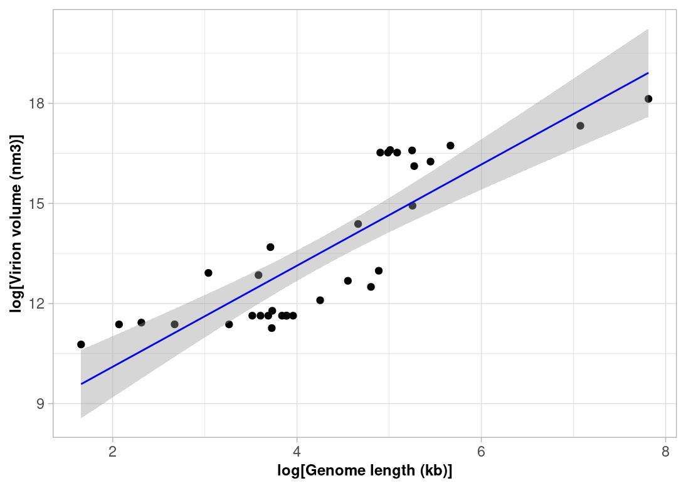

## Reproducible Research Assingment: Version Control and R

### Q1, Q2 and Q3: 
https://github.com/anoncoder555/logistic_growth

### Q4: Sometimes we are interested in modelling a process that involves randomness. A good example is Brownian motion. We will explore how to simulate a random process in a way that it is reproducible: ###

**a) A script for simulating a random_walk is provided in the `question-4-code` folder of this repo. Execute the code to produce the paths of two random walks. What do you observe? (10 points)**

In running `question-4-code`, we produce two random walk plots, each simulating 500 steps. The varaibility between the two random walk plots arises because each step in the walk is determined by a random angle sampled between 0 and 2π. The distance moved per step is set to 0.25, resulting in small movements each step to build the path. Random walks always intiate at the origin (0,0) as this is set in the code for time step 1. \
Time is visually represented by a colour gradient such that as time increases the walk progresses from dark blue to light blue. Every time the code is re-run, new random walks are generated for each right and left graph. Random walks are generated as there is no random seed set in the code and hence each path is determined by a random sequence of numbers each time. 

<p align="center">
  <strong>Graph of two random walks</strong>
</p>

   <p align="center">
     
  </p>
  

**b) Investigate the term **random seeds**. What is a random seed and how does it work? (5 points)**

A random seed is a number that initialises a pseudorandom number generator to produce a sequence of random numbers (Bethard, 2022). This allows the random number generator to produce a sequence of numbers that seem random but are instead determined by an initial starting value known as the seed. This allows sequences of random numbers to be reproducible by specifying the seed. \
Before specifying a seed in R, R will choose a random seed every time the code is run and hence choose a random sequence of numbers. In this way, the random walks will be different each time the code is run. Once we specify a seed, every time the code is run it will be fed the same sequence of numbers. This allows the walks to be reproducible as any user that specifies that seed will receive the same output. 

**c) Edit the script to make a reproducible simulation of Brownian motion. Commit the file and push it to your forked `reproducible-research_homework` repo. (10 points)**

I used the function `set.seed()` to set a random seed. This initiated a specific sequence of random numbers such that the random walks were reproducible each time. When the code is rerun, it produces an identical simulation of random walks every time. In this case I specified both the random walks with the same seeds (`set.seed(55)`) and hence the right and left graphs showed identical random walks. 

<p align="center">
  <strong>Graph of reproducible random walks</strong>
</p>
<p align="center">
     
  </p>

**d) Go to your commit history and click on the latest commit. Show the edit you made to the code in the comparison view (add this image to the **README.md** of the fork). (5 points)**


### 5) (**30 points**) In 2014, Cui, Schlub and Holmes published an article in the *Journal of Virology* (doi: https://doi.org/10.1128/jvi.00362-14) showing that the size of viral particles, more specifically their volume, could be predicted from their genome size (length). They found that this relationship can be modelled using an allometric equation of the form **$`V = \alpha L^{\beta}`$**, where $`V`$ is the virion volume in nm<sup>3</sup> and $`L`$ is the genome length in nucleotides. ###

**a) Import the data for double-stranded DNA (dsDNA) viruses taken from the Supplementary Materials of the original paper into Posit Cloud (the csv file is in the `question-5-data` folder). How many rows and columns does the table have? (3 points)**

The table has 33 rows and 13 columns.

**b) What transformation can you use to fit a linear model to the data? Apply the transformation. (3 points)**

The original relationship between volume and genome length is **$`V = \alpha L^{\beta}`$** which is non-linear. To fit a linear model to the data we must first transform it using a log transformation. Applying a log transformation to the original relationship **$`V = \alpha L^{\beta}`$** gives a relationship of **$`log(V) = \beta⋅log(L) + log(\alpha)`$**.

The code for this question can be found below or in full in `question_5.R` under Question (b).
```r
transformed_data <- Q5_data %>% 
  mutate(log_volume = log(`Virion volume (nm×nm×nm)`), log_g_length = log(`Genome length (kb)`))
```

**c) Find the exponent ($\beta$) and scaling factor ($\alpha$) of the allometric law for dsDNA viruses and write the p-values from the model you obtained, are they statistically significant? Compare the values you found to those shown in **Table 2** of the paper, did you find the same values? (10 points)**

Applying a log transformation to the original relationship **$`V = \alpha L^{\beta}`$** gives a relationship of **$`log(V) = \beta⋅log(L) + log(\alpha)`$** which can be used in a linear model to find the exponent ($\beta$) and scaling factor ($\alpha$).

The results of the linear model provide the slope, which corresponds to $\beta$, and the intercept, which corresponds to log($\alpha$). Hence, the values of $\beta$ and $\alpha$ are as follows: \
$\beta$ = **1.5152**  \
$\alpha$ = e<sup>7.0748</sup> = **1181.807**.

1. Slope corresponding to $\beta$ : \
The p value from the model was **6.44e-10**, which was statistically significant at a level of $p<0.001$.

2. Intercept corresponding to $\alpha$ : \
The p value from the model for the intercept was **2.28e-10**, which was statistically significant at a level of $p<0.001$.

The values found in Table 2 of the paper for dsDNA viruses were $\beta$ = **1.52** (1.16–1.87) and $\alpha$ = **1182** (246–5675), with 95% confidence intervals shown in brackets. Both my values for $\beta$ and $\alpha$ are identical to the values from Table 2 when rounded to 2 d.p..


**d) Write the code to reproduce the figure shown below. (10 points)** 

The code for this question can be found below or in full in `question_5.R` under Question (d).

```r
ggplot(aes(x = log_g_length, y= log_volume), data = transformed_data) +
  geom_point() +
  geom_smooth(method = "lm", se = T, color = "blue", size = 0.5) +
  labs(
    x = "log[Genome length (kb)]",
    y = "log[Virion volume (nm3)]"
  ) +
  theme_light() +
  theme(
    axis.title = element_text(
    hjust = 0.5,        
    size = 9,
    face = "bold")
    )
```
<p align="center">
  <strong>Original Graph</strong>
</p>

  <p align="center">
     
  </p>

<p align="center">
  <strong>My Graph</strong>
</p>

  <p align="center">
     
  </p>

**e) What is the estimated volume of a 300 kb dsDNA virus? (4 points)**

**$`V = \alpha L^{\beta}`$** 

$V$ = ? \
$\alpha$ = 1181.807 \
$L$ = 300 kb \
$\beta$ = 1.5152 

Subsitutue values into equation to get: \
1181.807⋅300<sup>1.5152</sup>

**$V$ = 6697006 nm<sup>3</sup>**

## Reference list:

Bethard, S. (2022) *We need to talk about random seeds.* Cornell University. https://doi.org/10.48550/arXiv.2210.13393

## Instructions

The homework for this Computer skills practical is divided into 5 questions for a total of 100 points. First, fork this repo and make sure your fork is made **Public** for marking. Answers should be added to the # INSERT ANSWERS HERE # section above in the **README.md** file of your forked repository.

Questions 1, 2 and 3 should be answered in the **README.md** file of the `logistic_growth` repo that you forked during the practical. To answer those questions here, simply include a link to your logistic_growth repo.

**Submission**: Please submit a single **PDF** file with your candidate number (and no other identifying information), and a link to your fork of the `reproducible-research_homework` repo with the completed answers (also make sure that your username has been anonymised). All answers should be on the `main` branch.

